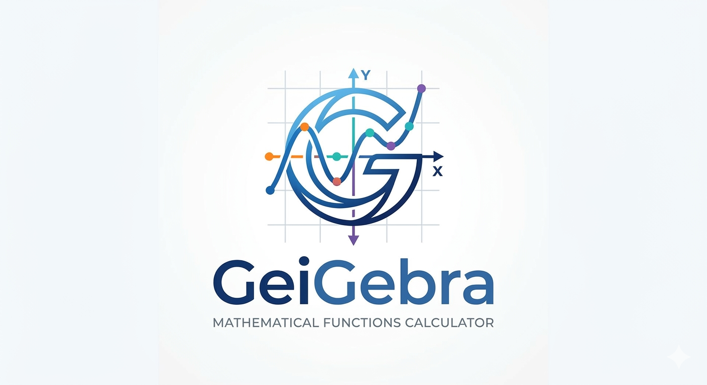

# 📐 GeiGebra - Function Calculator

<div align="center">



**An interactive tool to visualize and analyze mathematical functions**

[🚀 Access Application](https://geigebra.netlify.app/) • [📝 Report Bug](https://github.com/devjuvenilson/calculadora-funcao/issues) • [💡 Suggest Feature](https://github.com/devjuvenilson/calculadora-funcao/discussions)

</div>

---

## 🎯 About the Project

**GeiGebra** is an online function calculator developed to help **high school and university students** visualize, understand, and validate their mathematical calculations quickly and intuitively.

With a user-friendly interface and integration with the **Desmos Graph API**, the application allows users to:
- Visualize function graphs in real time
- Calculate roots of various functions such as first and second-degree
- Explore function behaviors interactively
- Validate answers for assignments and tests

---

## ✨ Key Features

✅ **Multiple Function Types** - Support for 11+ function types including linear, quadratic, polynomial, exponential, logarithmic, trigonometric, and more

✅ **Interactive Graphs** - Dynamic visualization with Desmos Calculator

✅ **Instant Calculations** - Real-time results as you type

✅ **Mathematical Formula Rendering** - LaTeX-style formula display for clear mathematical notation

✅ **Theme Toggle** - Light and dark mode support for comfortable viewing

✅ **Responsive Interface** - Full access on desktop, tablet, and mobile

✅ **Copy Results** - One-click copying of calculation results

✅ **Intuitive Design** - UX designed for students

---

## 🛠️ Tech Stack

| Technology | Usage |
|-----------|-------|
| **React 19** | Main framework |
| **React DOM 19** | Component rendering |
| **Desmos API v1.8** | Interactive mathematical graphs |
| **CSS3** | Styling and responsiveness |
| **JavaScript ES6+** | Application logic |

---

## � Supported Function Types

The calculator supports a wide range of mathematical functions:

- **First-Degree Functions** - Linear equations (f(x) = ax + b)
- **Second-Degree Functions** - Quadratic equations (f(x) = ax² + bx + c)
- **Biquadratic Functions** - Fourth-degree equations
- **Polynomial Functions** - Higher degree polynomials
- **Exponential Functions** - Exponential growth and decay
- **Logarithmic Functions** - Logarithmic curves
- **Trigonometric Functions** - Sine, cosine, and tangent
- **Constant Functions** - Horizontal lines
- **Modular Functions** - Absolute value functions

---

## �🚀 How to Use

### Option 1: Access Online (Recommended)

Visit **[geigebra.netlify.app](https://geigebra.netlify.app/)** and start using immediately!

### Option 2: Run Locally

#### Prerequisites
- Node.js v14+ installed
- npm or yarn

#### Installation

```bash
# Clone the repository
git clone https://github.com/devjuvenilson/calculadora-funcao.git
cd calculadora-funcao

# Install dependencies
npm install

# Configure environment variables
# Create a .env file in the project root:
echo "REACT_APP_DESMOS_API_KEY=your_key_here" > .env

# Start the development server
npm start
```

The application will open at `http://localhost:3000`

#### Build for Production

```bash
npm run build
```

The optimized bundle will be generated in the `build/` folder

---

## 📦 Project Structure

```
calculadora-funcao/
├── public/
│   └── index.html              # Main HTML
├── src/
│   ├── components/
│   │   ├── FuncaoPrimeiroGrau/ # Linear functions calculator
│   │   ├── FuncaoSegundoGrau/  # Quadratic functions calculator
│   │   ├── FuncaoBiquadratica/ # Biquadratic functions calculator
│   │   ├── FuncaoPolinomial/   # Polynomial functions calculator
│   │   ├── FuncaoExponencial/  # Exponential functions calculator
│   │   ├── FuncaoLogaritmica/  # Logarithmic functions calculator
│   │   ├── FuncaoSenoidal/     # Sine function calculator
│   │   ├── FuncaoCossenoidal/  # Cosine function calculator
│   │   ├── FuncaoTangente/     # Tangent function calculator
│   │   ├── FuncaoConstante/    # Constant function calculator
│   │   ├── FuncaoModular/      # Modular function calculator
│   │   ├── DesmosGraph/        # Desmos API integration for graph visualization
│   │   ├── BotaoCalcular/      # Reusable button component
│   │   ├── CopyButton/         # Copy results button component
│   │   ├── SignToggleButton/   # Toggle button for sign operations
│   │   ├── ThemeToggle/        # Light/dark theme toggle
│   │   └── Tooltip/            # Tooltip component for help text
│   ├── context/
│   │   └── ThemeContext.jsx     # Global theme context for light/dark modes
│   ├── pages/
│   │   └── Home/               # Main application page
│   ├── services/
│   │   └── FormulaRender.jsx    # Mathematical formula rendering utility
│   ├── styles/
│   │   └── darkTheme.css        # Dark theme stylesheet
│   ├── assets/                 # Images and icons
│   └── index.js                # Application entry point
├── .env                        # Environment variables (do not commit)
├── package.json
└── README.md
```

---

## 🔒 Security

The Desmos API Key is loaded dynamically through environment variables (`REACT_APP_DESMOS_API_KEY`), ensuring:

- ✅ Key protection in public repositories
- ✅ Different keys for dev and production environments
- ✅ Secure loading at build time

**Never** commit the `.env` file with real values. Use `.env.example` as a template.

---

## 🤝 How to Contribute

We'd love your contribution! To contribute:

1. **Fork** the project
2. Create a branch for your feature (`git checkout -b feature/AmazingFeature`)
3. Commit your changes (`git commit -m 'Add some AmazingFeature'`)
4. Push to the branch (`git push origin feature/AmazingFeature`)
5. Open a **Pull Request**

### Guidelines
- Clean and well-commented code
- Tests for new features
- Follow the project's code style
- Update the README if necessary

---

## 🐛 Report Bugs

Found a bug? Open an [issue](https://github.com/devjuvenilson/calculadora-funcao/issues) with:
- Clear description of the problem
- Steps to reproduce
- Screenshots (if applicable)
- Environment (OS, browser, version)

---

## 📄 License

This project is licensed under the MIT License - see the [LICENSE](LICENSE) file for details.

---

## 👨‍💻 Developer

Developed for the student community

**Contact & Networks:**
- GitHub: [@DevJuvenilson](https://github.com/DevJuvenilson)
- LinkedIn: [Juvenilson](https://linkedin.com/in/juvenilsondaniel)

---

<div align="center">

**⭐ If this project was helpful, please consider giving it a star!**

</div>
